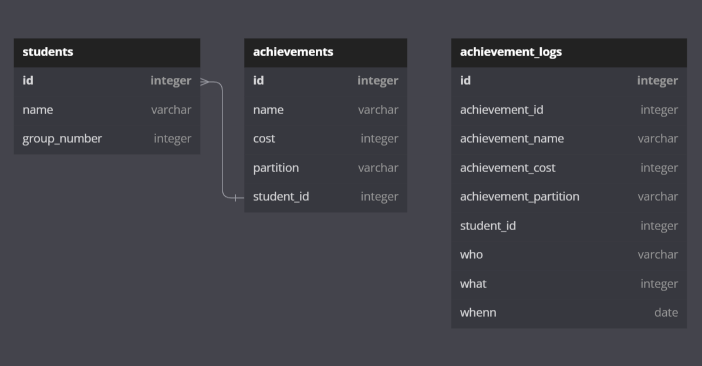

## Запуск кода
```bash
docker-compose up -d
```

## Удаление базы
```bash
docker-compose down -v
```

## Подключение к базе
```yaml
Connection type: Service name
Service: XEPDB1
User: SYSTEM
Password: root
```

## Архитектура таблиц


